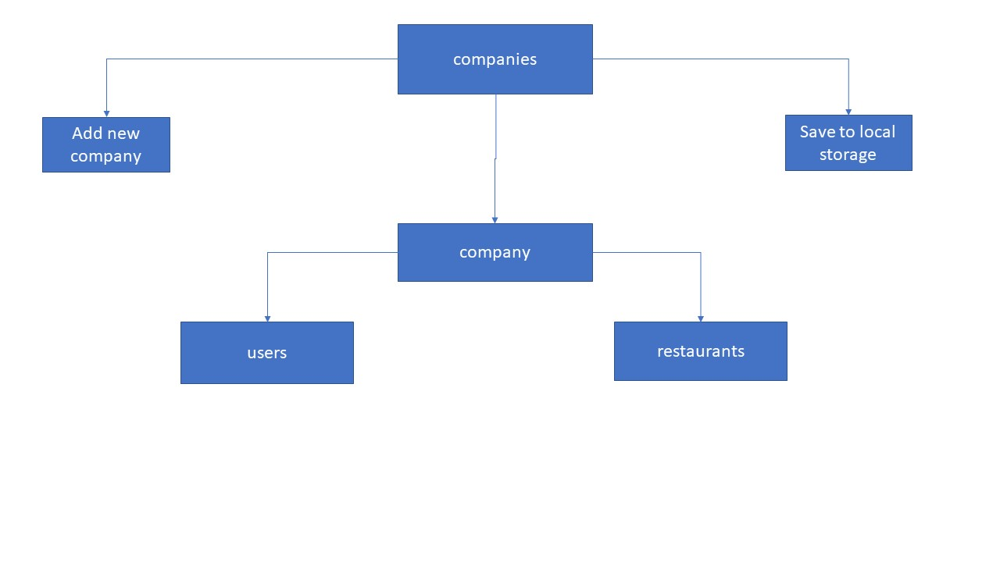

# yumYum
Website about ordering food for communities or companies.

# What is yumYum?
Ordering your food have never been that easy. Our website provides the best ways to order food using a unique *community registration* which allows the companies (or any kind of community like groups) to register their employees to our system.
We provide discounts for the registered members when they order for their favourite resturants starting from  10 orders from the same community ending with a free delivery option when they exceed 30 orders.
Although our system keeps track of the companies break hours to delivere their daily meals as soon as the braek starts.
What are you waiting for??! Your food is a button away from you!one click the meal be in front of you!Dream achieved right!! ;)
come on! Register to our website and order your first meal!

# oUr story 
Hmmm our story started from our suffering to get our meals in fast and in our break times and with free meals *-* life is becoming more colorful lol! as we are  working in a computing company and every day during our work; we spend so much time deciding what we will eat and because we are more than ten people it will take so much time so we need something to make it easier we make *yumYum* which will give us opportunity to share what we decide to make it easier for me and my colleagues to decide what we will order and for yummy free delivery meals that we get! we are  so happy to create *yumYum* it makes our day and whole our next days always yum yummy! :)) 

# object model

